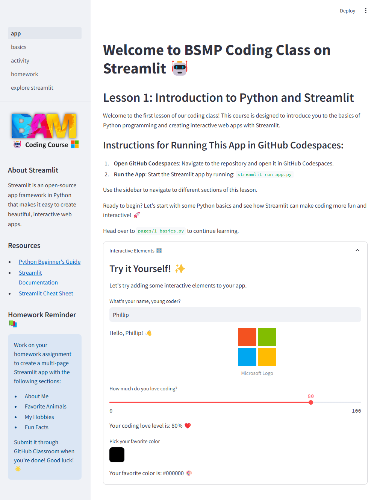

# Lesson 1: Hello World with Streamlit 🖥️  
   
Welcome to the first lesson of the BSMP Coding Class! In this lesson, we'll introduce you to the basics of Python and Streamlit by guiding you through creating your first Streamlit app. 🚀  




## What You'll Learn 📚  
- **Python Basics**: Understand simple Python concepts like print statements, variables, data types, and using python libraries (e.g., Streamlit!).  
- **Streamlit Basics**: Learn how to create interactive web apps with Streamlit.  
   
## Getting Started 🚦  
   
### Step 1: Set Up Your Environment  
1. **Open GitHub Codespaces**: Navigate to the repository and open it in GitHub Codespaces.  
2. **Run the App**: Start the Streamlit app by running the following command in the terminal: 
   ```bash  
   streamlit run app.py
   ```  

### Step 2: Create Your First Streamlit App  
Follow these steps to create a simple Streamlit app:  
   
1. **Open a New Python Script**: Create a new Python script called `hello_world.py`.  
2. **Enter the Following Code**:  
   ```python  
   import streamlit as st  #👈 the streamlit library is imported and aliased as st
  
   st.title("Hello World! 🌍")  
   st.header("This is a header")  
   st.write("Welcome to your first Streamlit app. 🎉")  
   ```  
3. **Run Your App**: Save your script and run the app using the command:  
   ```bash  
   streamlit run hello_world.py  
   ```  
   
### Step 3: Enhance Your App  
Try adding some interactive features to your app:  
   
- **Add a Subheader**:  
  ```python  
  st.subheader("This is a subheader")  
  ```  
- **User Input**:  
  ```python  
  name = st.text_input("Enter your name:")  
  st.write(f"Hello, {name}!")  
  ```  
- **Date Input**:  
  ```python  
  from datetime import datetime  
  date = st.date_input("Choose a date", datetime.now())  
  st.write(f"The selected date is {date}")  
  ```  
   
## Homework Assignment 📋  
Create a multi-page Streamlit app with the following sections:  
1. **About Me**: Introduce yourself.  
2. **Favorite Animals**: Display a list of your favorite animals with images.  
3. **My Hobbies**: Describe your hobbies and use interactive elements.  
4. **Fun Facts**: Share fun facts about yourself using columns and layout features.  
   
### Submitting Your Work  
Accept the GitHub Classroom homework invitation and submit your completed app. Refer to the [BSMP Homework Submission process](https://bsmp-coders.github.io/#/students/Getting-Started?id=_4-submitting-your-homework-assignment-how-to-commit-and-push-changes) for additional help.  
   
## Additional Resources 📖  
- [Streamlit Documentation](https://docs.streamlit.io/)  
- [Python Documentation](https://docs.python.org/3/)  
   
Ready to dive in? Let's get coding and have fun with Streamlit! 🎉  